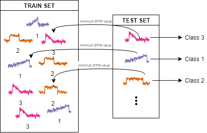
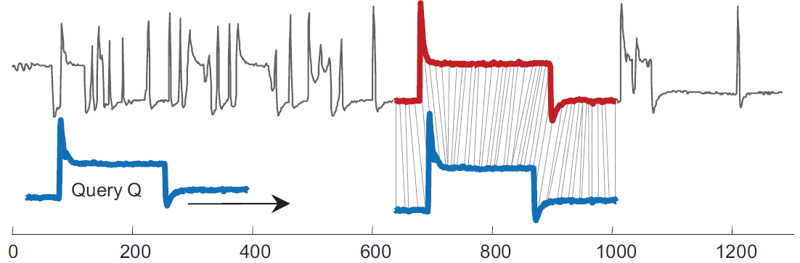

# Multivariate Time Series Software (MTSS)

A GP-GPU/CPU Dynamic Time Warping (DTW) implementation for the analysis of Multivariate Time Series (MTS).

## What MTSS is?

MTSS is a GPU/CPU software designed for the **_classification_** and the **_sub-sequence similarity search_** of MTS. Originally inspired by [1], MTSS aims to improve the *time performance* and *accuracy* for classifying and sub-searching any kind of MTS by using the well known similarity measure: **_Dynamic Time Warping (DTW)_**.

**Classification**

The *Classification* task aims to predict group membership for MTS instances belonging to set of data. Supposing we have already split the initial data set into `train set` and `test set`, the membership group for each MTS of the test set is assigned by comparing the *i*-th MTS of the latter over all the MTS belonging to the train set and, then select the membership group for which the comparison against all the MTS in the train set is minimum in term of DTW similarity measure. As mentioned above, we can provide three different type of similarity measure for comparing two MTS.

 

**Sub-sequence similarity search**

The *Similarity subseq-search* aims to find the best match for a time series (known as the query) onto another time series (known as instance). That's achieved by punctually shifting the *instance* time series on the *query* one and comparing it by using a similarity distance such as DTW (See figure below). 

 

Although each of the two tasks can be perfomed both on **CPU** ans **GPU**, the latter implementation improves *speed-up* and *accuracy* of the the above citated tasks when compared to single-threaded CPU implementation. It's important to stress out that the software's speed-up performace gets better when the variables ruling the speed complexity of those two tasks drastically increase. 

The software allow to uses three different types of DTW, namely:

1. **D-MDTW:** Dependent-Multivariate Dynamic Time Warping
2. **I-MDTW:** Independent-Multivariate Dynamic Time Warping
3. **R-MDTW:** Rotation-Multivariate Dynamic Time Warping

For more information, please refer to [1-2].

## Dependecies

The software is purely written in CUDA, using the C/C++ language as support. In order to use it you must have installed:

1. A working gcc compiler.

2. A CUDA version 5.0 or greater. For installing, please refer to the [official CUDA documention](http://docs.nvidia.com/cuda/#axzz4al7PKeAs).

3. Check library unit testing framework. For installing, please refer to the [official documentation](https://libcheck.github.io/check/index.html)

## Usage
Runn the following command to clone the `master` repository into a *target* directory:

`git clone https://github.com/DavideNardone/MTSS-Multivariate-Time-Series-Sofwtare.git <target>`

### Compiling

Once you are on the top folder, you can install the software by running the following commands:

`autoreconf -i && automake --add-missing`

`./configure && make && make install`

These two commands will ensure that you'd have all the compiled files you need for using the software. 

### Running

The software can be used as a **standard command line tool** with a list of options that are explained as follows. 

The program can run with the following flag options:

- **-t**: It's used to decide which task to perform (e.g., CLASSIFICATION, SUBSEQ_SEARCH)
- **-i**: It represents some input parameters, that is:
  1. The version you want to use: *CPU* or *GPU*;
  2. The number of dimension for the MTS;
  3. Depending on the first parameter, it represents the *#thread* for each block (GPU) and/or the *read mode*.
  
  **NOTE:** For more information about the *read mode*, please refer to the section **_Data Format_**.
- **-f**: It's used to specify the file path of the data (refer to the section **_Data Format_**).
- **-k (optional)**: In the **CLASSIFICATION** task is possible to perform *k-fold cross validation* by specifying the number of folders (e.g., -k 10 0). An additional flag(0-1) is used for performing the shuffling among the folders generated.  
**NB:** Setting the flag to `1` does not allow the reproducibility of the results on the same dataset among the GPU and CPU versions.
- **-o**: Depending on the *task* and *read mode*, the following parameters represents:
  * **CLASSIFICATION (read-mode=0 oppure 1):**
  1. The number of MTS samples;
  2. The length of each MTS sample (same size for each dimension);
    
  **NOTE:** For this combination it's necessary the *-k flag*.
  **** 
  * **CLASSIFICATION (read-mode=2):**
  1. The number of MTS sample in the TRAINING SET;
  2. The number of MTS sample in the TESTING SET;
  3. The MTS length (same size for each dimension).
  **** 
  * **SUBSEQ_SEARCH (read-mode=0 oppure 1):**
  1. The MTS length (same size for each dimension);
  2. The MTS *query*'s length to search for.
- **-m**: It's used to specify the type of **_MDTW_** to use:
  * **0**: Dependent similarity measure;
  * **1**: Independent similarity measure;
  * **2**: Rotation similarity measure (It suites only for the CLASSIFICATION task)
  * **\<similarity distance\>**: ED or DTW.
- **-v**: Verbose flag for skipping some or all of the output information (e.g., -v 50, display information at each 50th iteration)
- **-d**: It specify the GPU's ID to use (e.g. 0: GeForce GTX TITAN X).
- **--help**: It quickly explain how the MTSS software works.
- **--version**: It shows the info version about the sofware.

### Data format

At the moment, MTSS works only with `txt` file format. Depending on the type of task to perform, the data file must be adequayely formatted.

**_CLASSIFICATION_**

For this task, MTSS provides three different types of reading mode:

1. read-mode=0: It's possible to feed MTSS with two files, `[DATA, LABEL]`. The `DATA` file must be formatted as a *T*D* data matrix, where each row must represents the t-th features values of the MTS at the time instant *d-th* (in this case, the MTS are appended in the file), while the `LABEL` file just contains the integer class label. (A template file is placed in [data/classification/rm_0](data/classification/rm_0)

2. read-mode=1: It's possible to feed MTSS with *N files*, where each of them is formatted as a *N*T* data matrix, where each row at the first position must contain an integer class label followed by *T-1* values of the MTS. (A template file is placed in [data/classification/rm_1](data/classification/rm_1)).

3. read-mode=2: It's possible to feed MTSS with a `TRAIN SET` and a `TEST SET` file. Both the file must be formatted as *D\*T* data matrix, where each d-th row must contain the MTS values, where the latter MTS are appended in a file. (A template file is placed in [data/classification/rm_2](data/classification/rm_2)).

**SUBSEQ_SEARCH**

For this task, MTSS takes in input two files `[T_SERIES, Q_SERIES]`. The `T_SERIES` represents the time series on which the `Q_SERIES` has to be searched. Both the files must be formatted as *D*T* data matrix where each column must contain the dimensional values of the `T_SERIES` at each time instant *t* and viceversa (depending on the read-mode (0|1)). (A template file is placed in [data/subseq_search/](data/subseq_search/).

**NOTE:** The MTSS presented here assume that all the MTS have the same time length.

## Dataset 

All the information about the template data set [3] can be retrieved at the following source: https://sites.google.com/site/dtwadaptive/home

# Examples

Some examples follow:

**CLASSIFICATION**

**Compiling**

`nvcc -arch=sm_30 source/MD_DTW.cu source/module.cu -o mdtwObj`

**Running**

CPU: 

`./mdtwObj -t CLASSIFICATION -i CPU 3 0 -f data/classification/rm_0/DATA data/classification/rm_0/LABEL -k 10 0 -o 1000 152 -m 0 DTW -d 0 -v 0`

`./mdtwObj -t CLASSIFICATION -i CPU 3 1 -f data/classification/rm_1/X_MAT data/classification/rm_1/Y_MAT data/classification/rm_1/Z_MAT -k 10 0 -o 1000 152 -m 0 DTW -v 0`

`./mdtwObj -t CLASSIFICATION -i CPU 3 2 -f data/classification/rm_2/TRAIN data/classification/rm_2/TEST -o 150 850 152 -k 10 0 -m 0 DTW -v 0`

GPU:

`./mdtwObj -t CLASSIFICATION -i GPU 3 512 0 -f data/classification/rm_0/DATA data/classification/rm_0/LABEL -k 10 0 -o 1000 152 -m 0 DTW -d 0 -v 0`

`./mdtwObj -t CLASSIFICATION -i GPU 3 512 1 -f data/classification/rm_1/X_MAT data/classification/rm_1/Y_MAT data/classification/rm_1/Z_MAT -k 10 0 -o 1000 152 -m 0 DTW -d 0 -v 0`

`./mdtwObj -t CLASSIFICATION -i GPU 3 512 2 -f data/classification/rm_2/TRAIN data/classification/rm_2/TEST -o 150 850 152 -k 10 0 -m 0 DTW -d 0 -v 0`

**SUBSEQ_SEARCH**

**Compiling**

`nvcc -arch=sm_30 source/MD_DTW.cu source/module.cu -o mdtwObj`

**Running**

CPU: 

`./mdtwObj -t SUBSEQ_SEARCH -i CPU 3 0 -f data/subseq_search/T_series data/subseq_search/Q_series -o 3907 421 -m 0 DTW -v 0`

GPU:

`./mdtwObj -t SUBSEQ_SEARCH -i GPU 3 512 0 -f data/subseq_search/T_series data/subseq_search/Q_series -o 3907 421 -m 0 DTW -d 0 -v 0`

**NOTE:** The implementation presented here assumes that each compared MTS has the same time length.

# TESTS

In order to validate the software, some _unit tests_ are provided in the `tests` folder. These units can be exectuted by installing the [check framework](https://libcheck.github.io/check/) and by running the following executable file:

`/tests/unit_test`

# BENCHMARK

In order to compare the time performance between the CPU and GPU implementations when the keys task parameters change, we provided a benchmark test for exploring a range of all combined parameters. The benchmark run may take awhile to get completed, so in case the user is interested in testing only some parameters combination, he/she can modify the file `benchmark.cu` code ad-hoc and the run the executable file:

`/tests/benchmark`

# AUTHORS

Davide Nardone, University of Naples Parthenope, Science and Techonlogies Departement, Msc Applied Computer Science
https://www.linkedin.com/in/davide-nardone-127428102/
  
# CONTACTS

For any kind of problem, questions, ideas or suggestions, please don't esitate to contact me at: 
- **davide.nardone@live.it**

## References

[1] Sart, Doruk, et al. "Accelerating dynamic time warping subsequence search with GPUs and FPGAs." Data Mining (ICDM), 2010 IEEE 10th International Conference on. IEEE, 2010.
APA

[2] Shokoohi-Yekta, Mohammad, Jun Wang, and Eamonn Keogh. "On the non-trivial generalization of dynamic time warping to the multi-dimensional case." Proceedings of the 2015 SIAM International Conference on Data Mining. Society for Industrial and Applied Mathematics, 2015.

[3] Shokoohi-Yekta, M., Hu, B., Jin, H. et al. Data Min Knowl Disc (2017) 31: 1. https://doi.org/10.1007/s10618-016-0455-0

## License

[MIT LICENSE](LICENSE)

# Paper

The following software is under review for the [The Journal of Open Source Software](https://joss.theoj.org/papers/0a9f9006cebb80198e0ad5448cc1fc10).
